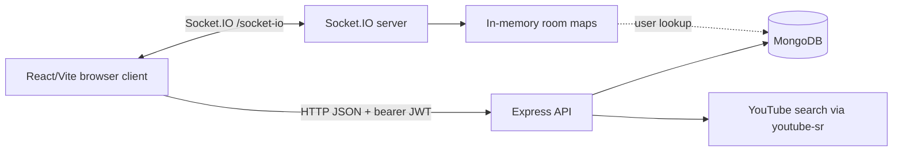

# Architecture

This document describes observed implementation behavior. Suspected defects are isolated in [known issues](known-issues.md).

## System boundary

The client starts at `client/src/index.jsx`, mounts routing through `client/src/App.jsx`, and uses Rematch models from `client/src/models/`. Axios requests go through `client/src/utils/http.js`; realtime operations go through `client/src/context/SocketEventsContextProvider.jsx`.

The server starts at `server/server.js`. It begins unready, connects the database selected by `server/config/createDatabase.js`, listens using `server/config/config.js`, attaches Socket.IO on `/socket-io`, and then marks itself ready. Express routes are mounted by `server/app/routes/routes.js`; rejected asynchronous routes flow through terminal error middleware. Realtime handlers registered in `server/lib/socketIo.js` use their own promise boundary because Express middleware cannot observe Socket.IO callbacks.

## State ownership

| State | Owner | Lifetime | Authoritative paths |
| --- | --- | --- | --- |
| Registered users | MongoDB via Mongoose | Persistent | `server/app/models/users.model.js`, auth controller |
| Saved playlists | MongoDB via Mongoose | Persistent | `server/app/models/playlists.model.js`, playlists controller |
| Authentication token | Browser storage; JWT verified by server | Until removed/expired | `client/src/utils/token-storage.js`, auth middleware |
| Room and host | Server `rooms` Map | Process lifetime or until empty | `server/lib/roomsController.js` |
| Connected room users | Room object plus socket-to-user `users` Map | Socket/process lifetime | `server/lib/roomsController.js` |
| Current video, playback and progress | Room object | Room lifetime | `server/lib/roomsController.js` |
| Shared queue | Room object | Room lifetime | `server/lib/roomsController.js` |
| Chat (maximum 40 entries) | Room object | Room lifetime | `server/lib/roomsController.js` |
| Rendered client state | Rematch store | Browser page lifetime | `client/src/store.js`, `client/src/models/` |

## Runtime flows

Room creation and validation use HTTP; joining and all shared interaction use Socket.IO. The server broadcasts partial room updates, which the client shallow-merges into the Rematch room model. See [room lifecycle](domain/rooms.md), [HTTP contracts](contracts/http-api.md), and [WebSocket contracts](contracts/websocket-events.md).

The Room route presents playback and collaboration as one responsive workspace. The player and metadata remain the primary region, while video search, the compact shared queue, and chat render as labelled in-page sections rather than mutually exclusive drawers. Participant avatars and invitation access live in the room header. Wide viewports use a two-column composition; narrow viewports preserve every workspace section in a single scrollable flow. Chat autoscroll is confined to its message history and does not move the page viewport. This presentation does not change the HTTP and Socket.IO ownership described above.

Authentication registration creates both a `User` and a default `Playlist`. Login returns a bearer token, and `whoAmI` restores the user on client startup. YouTube search and autocomplete are server-side calls through `youtube-sr`.

## Deployment shape

Local Vite runs on port 3000. The browser defaults API and Socket.IO traffic to port 5000. The server itself defaults to 3000 unless `PORT` is set; Docker Compose maps host `5000` to container `3000` and exposes MongoDB on host `27018`. The server container and MongoDB communicate over the Compose `backend` network.

Recoverable HTTP and realtime failures are contained at their framework boundaries. An uncontained rejection or uncaught exception is treated as fatal: readiness is removed, HTTP/Socket.IO/MongoDB receive a bounded close attempt, and the process exits non-zero. The development Compose stack retains Nodemon hot reload and checks `/health`; a production supervisor must run `npm start` and replace the process after a non-zero exit. A fatal restart discards all rooms, queues, playback and chat because that state is intentionally process-local.
