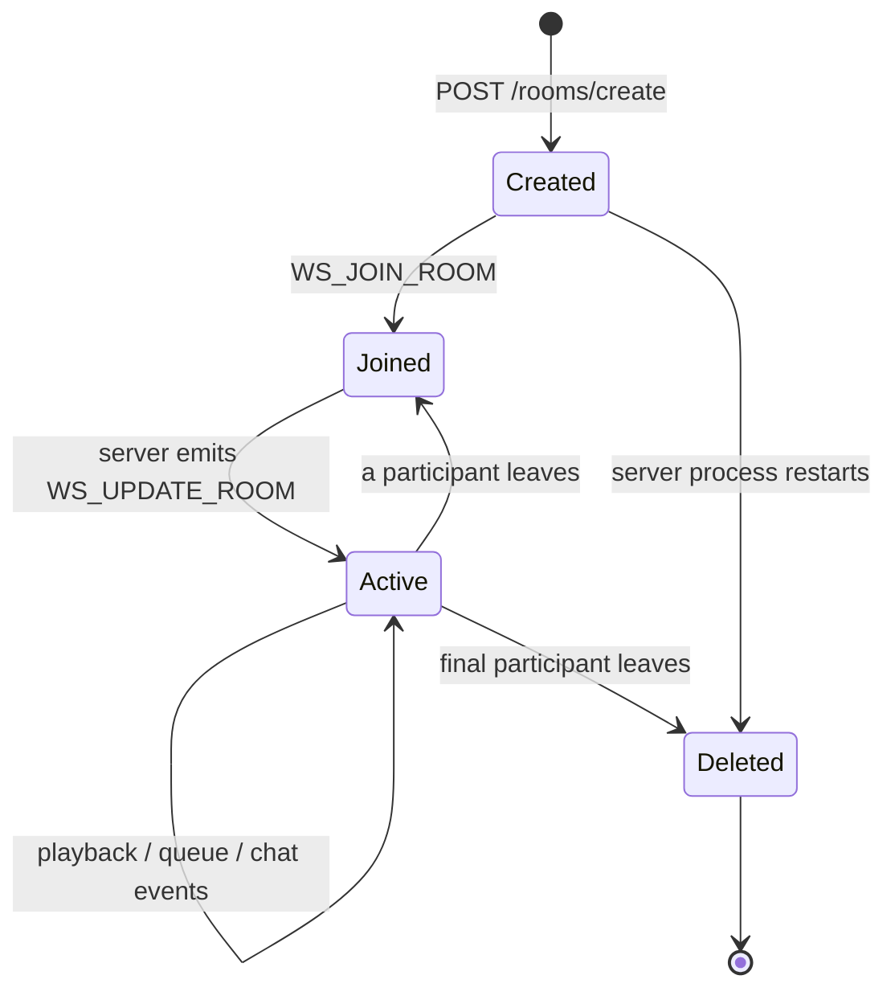

# Room lifecycle

This document records behavior observed in `server/lib/roomsController.js` and its consumers. It does not turn findings in [known issues](../known-issues.md) into desired behavior.

## Creation and validation

`POST /rooms/create` requires a bearer-authenticated user, generates an ID, and stores a room with the authenticated user's stored name as `host`, an initial video, empty users/chat/queue, and progress 0. The endpoint does not accept creator identity from the client. Creation does not join the creator. `GET /rooms/:id/isValid` remains public and checks the server-memory map. The Home page creates then navigates; `client/src/hooks/useRoom.js` validates the URL before the Room page joins.

The Home page keeps Create room visible to guests. Activating it opens an authentication-required popup rather than calling the endpoint; login or registration begun there resumes creation once after authentication. Session restoration must settle before creation is available. These client checks provide guidance, while the server middleware remains the authorization boundary.

## Identity and joining

The Room page waits for restored authentication. Joining remains public: a guest supplies a nickname, while a logged-in user sends the stored name. `WS_JOIN_ROOM` carries `{ roomId, name, isLogged }`. Logged users are looked up in MongoDB; guests receive generated IDs and avatars. The controller maps the socket to the user, appends an administrative chat entry, joins the Socket.IO room and emits current state. Joining an unknown identifier does not create a room.

## Playback and progress

`WS_VIEW_VIDEO` selects a video, resets progress and starts playback. `WS_SEND_PLAYER_STATE` maps `play` to `isPlaying: true` and other states to false. `WS_SEND_PROGRESS` stores seconds and broadcasts progress; when `seekVideo` is true it tells other clients to seek. `client/src/pages/Room/Room.jsx` emits progress from ReactPlayer and applies server updates.

## Shared queue

`WS_ADD_VIDEO` gives the item a generated room-local ID and appends it. `WS_REORDER_PLAYLIST` replaces the queue. `WS_REMOVE_VIDEO` removes an item; if it was current and another item remains, the controller selects an adjacent item, resets progress and starts it. Search results come from HTTP YouTube endpoints, then UI components emit queue events.

## Chat

`WS_SEND_MESSAGE` appends `{ emitter, msg, time, color, isAdmin: false }`. Join messages are administrative entries. Once the chat exceeds 40 entries, the oldest entry is removed. Chat exists only in the room object.

## Leaving, host reassignment and deletion

The client emits `WS_LEAVE_ROOM` during Room cleanup; transport closure can also call leave handling. The controller removes the socket mapping and participant. If nobody remains, the room is deleted. Otherwise, current observed behavior assigns a randomly selected remaining user's name to `host`, broadcasts users, and emits a leave notification. The host reassignment caveat is documented separately because the code does this after every departure.
